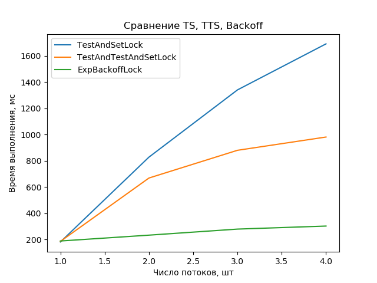
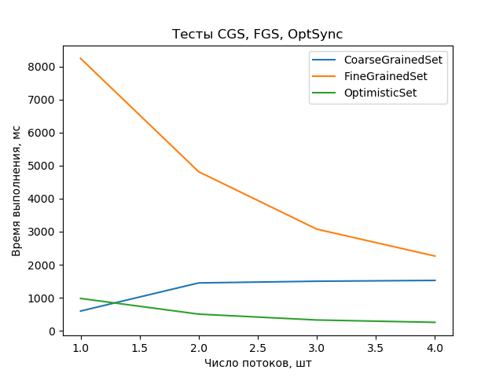

# Лабораторная 1. Алгоритмы блокировки потоков

**Задание на 4. Вариант 2.** Сравнить алгоритмы TestAndSet, TestAndTestAndSet, Backoff

## Сборка

```bash
# Загрузка исходников
git clone https://github.com/cuamckuu/parallel-algo-labs.git
cd parallel-algo-labs

# Сборка проекта
mkdir lab1_build
cd lab1_build
cmake ../spin-locks-benchmark
make

# Запуск
./SpinLocksBenchmark

# Построение графиков
./SpinLocksBenchmark > ./../spin-locks-benchmark/plots/data.txt
cd ./../spin-locks-benchmark/plots
python3 main.py

# Открыть файл res.png
```

## Теоретический результат


## Результат эксперимента



## Выводы

> TODO

# Лабораторная 2. Разделяемые структуры данных

**Задание на 4. Вариант 2.** Список (множество) на основе блокировок, 3 метода из лекций

```bash
# Загрузка исходников
git clone https://github.com/cuamckuu/parallel-algo-labs.git
cd parallel-algo-labs

# Сборка проекта
mkdir lab2_build
cd lab2_build
cmake ../locks-based-sets
make

# Запуск
./LocksBasedSets

# Построение графиков
./LocksBasedSets > ./../locks-based-sets/plots/data.txt
cd ./../locks-based-sets/plots
python3 main.py

# Открыть файл res.png
```

## Результат эксперимента



## Выводы

> TODO