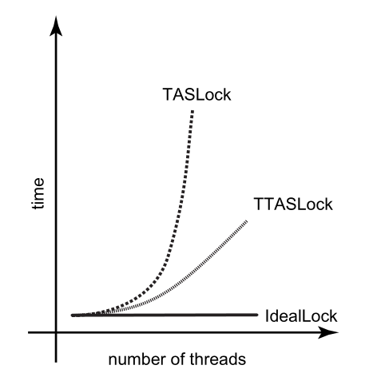
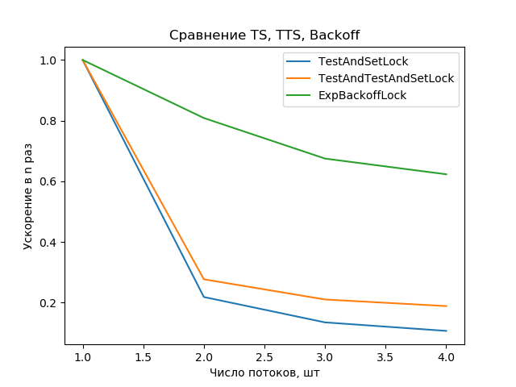
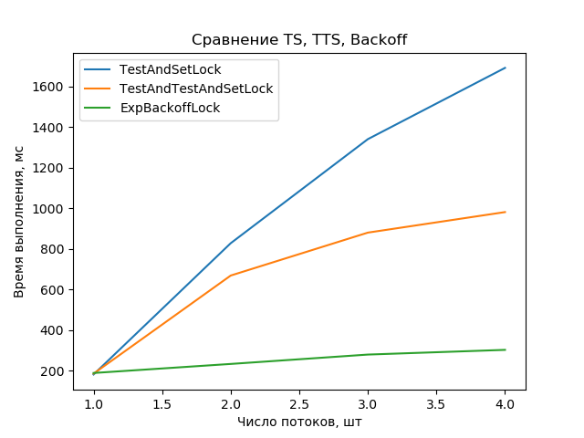
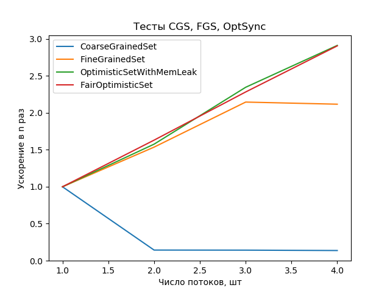
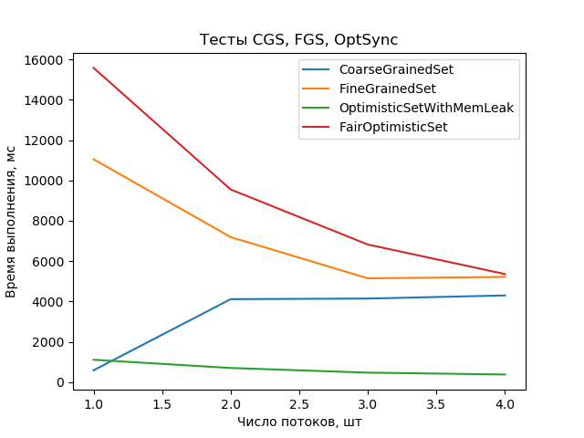

# Лабораторная 1. Алгоритмы блокировки потоков

**Задание на 4. Вариант 2.** Сравнить алгоритмы TestAndSet, TestAndTestAndSet, Backoff

## Сборка

```bash
# Загрузка исходников
git clone https://github.com/cuamckuu/parallel-algo-labs.git
cd parallel-algo-labs

# Сборка проекта
mkdir lab1_build
cd lab1_build
cmake ../spin-locks-benchmark
make

# Запуск
./SpinLocksBenchmark

# Построение графиков
./SpinLocksBenchmark > ./../spin-locks-benchmark/plots/data.txt
cd ./../spin-locks-benchmark/plots
python3 main.py

# Открыть файлы speed.png и time.png
```

## Теоретический результат



## Результат эксперимента





## Выводы

Из-за того, как устроена блокировка TestAndSetLock может возникать борьба за ресурсы из-за инвалидации кэша процессора или из-за занятости шины данных. В случае с TestAndSetLock, каждый поток обращается к шине, заставляя остальные потоки ждать, так как шина работает с одним потоком за раз. Кроме того, каждый поток инвалидирует кэш других потоков из-за чего происходит промах кэша почти при каждом обращении. Кроме того, у TestAndSetLock могут возникнуть проблемы и с разблокировкой, если шина будет занята ожидающими потоками.

В случае с TestAndTestAndSet описанная ситуация улучшается, так как теперь промах кэша происходит не каждый раз, а только в первый, если поток, заблокировавший ресурс не менялся. Раз промаха не происходит, ожидающему потоку не приходится обращаться к шине и блокировать её, что также упрощает разблокировку для потока, заблокировавшего ресурс. Проблема в том, что при разблокировке, происходит общая инвалидация кэша и всем потоком требуется одновременное обращение к шине, что возвращает нас к предыдущему случаю.

Для разрешения проблемы был придуман способ с “отступлением”. Как выяснилось, если за какой-то ресурс ведётся активная конкуренция, то имеет смысл подождать пока она закончится и попробовать снова. Причём отступать или ждать стоит тем сильнее и дольше, чем сильнее ведётся конкуренция за блокировку ресурса. Такой подход реализован в классе ExpBackoffLock, и как видно из графиков, он хорошо себя показывает и лучше всего масштабируется, хотя всё же не является идеальным и показывает тенденцию к замедлению при увеличении числа потоков.

# Лабораторная 2. Разделяемые структуры данных

**Задание на 4. Вариант 2.** Список (множество) на основе блокировок, 3 метода из лекций

```bash
# Загрузка исходников
git clone https://github.com/cuamckuu/parallel-algo-labs.git
cd parallel-algo-labs

# Сборка проекта
mkdir lab2_build
cd lab2_build
cmake ../locks-based-sets
make

# Запуск
./LocksBasedSets

# Построение графиков
./LocksBasedSets > ./../locks-based-sets/plots/data.txt
cd ./../locks-based-sets/plots
python3 main.py

# Открыть файлы speed.png и time.png
```

## Результат эксперимента





## Выводы

При работе с одним потоком CoarseGrainedSet оказался самым эффективным, скорее всего так происходит из-за удачного попадания в кэш процессора, так как мютекс оказывается всего один и поток тоже один, процессору становится проще поддерживать кэш и ускорить вычисления, не обращаясь лишний раз к шине. Проблема в том, что при увеличении числа потоков CoarseGrainedSet замедляется, после чего работает примерно одинаково, независимо от числа потоков. Так происходит из-за того, что все потоки выстраиваются в очередь и обращаются к CoarseGrainedSet друг за другом.

Лучше себя ведёт FineGrainedSet, но так получилось, из-за того, что в тесте рассматриваются операции со случайными элементами. Если бы потоки работали с последовательными элементами, ситуация была бы сильно хуже, так как при обходе узлов они блокируются, из-за чего многим потокам пришлось бы ждать. Кроме того, начиная с 3-х потоков, FineGrainedSet перестал ускоряться, скорее всего так произошло из-за того, что потоки снова начали блокировать узлы и мешать друг другу при обходе.

Самым оптимальным оказался OptimisticSet. Как видно из графика, он продолжает ускоряться при увеличении числа потоков, что делает его привлекательным для работы в задачах, требующих распараллеливания. Так происходит из-за того, что обход узлов в OptimisticSet является неблокирующим. К сожалению, это порождает ряд проблем в языках без сборки мусора.

Как видно из графика времени выполнения, реализация без утечек памяти (на основе smart_ptr) требует больших затрат времени. Скорее всего проблему можно исправить, если избавиться от умных указателей и перейти к ленивой синхронизации, помечая узлы для удаления, и удаляя их, только спустя какое-то время, когда никто из потоков не будет по ним проходить.

В целом наиболее предпочтительным для применения в параллельных системах является OptimisticSet или LazySet, тогда как для работы с преимущественно одним потоком (и редкими использованиями нескольких) стоит рассмотреть CoarseGrainedSet.
